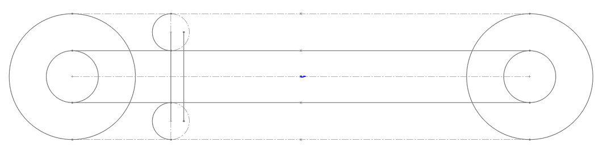

# Mechanism 4

<!--  -->

Mechanism Description:
-----------------------
This mechanism is a reciprocating linear motion system featuring constant velocity. It is constructed using two chains driven by 2 compound sprockets so that the chains have different velocities. 

If the linear velocities of inner and outer chain are respectively:

v1 and v2 where

v2 = xv1, x > 1

Then the velocity of the **wheel is:
vw = v2 - v1 = v1(x-1)

Wheel 1 and wheel 2 are alternately contacting the chains, therefore the carriage reciprocates at a speed of v1(x-1)

Design problem: instantaneous change in direction