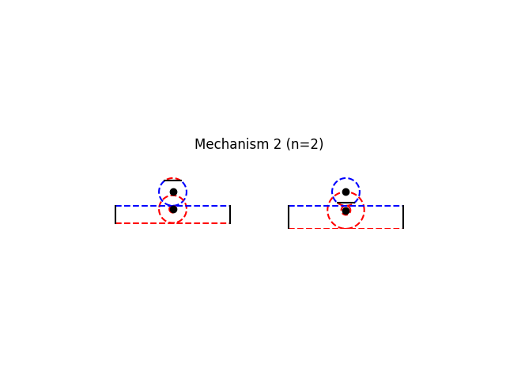

# Mechanism 2




Mechanism Description:
-----------------------
This mechanism is a reciprocating linear motion system featuring constant velocity and a quick return mechanism. It is constructed using two racks and a compound mangled pinion and a compound gear, designed to convert continuous rotary motion into linear motion with specific characteristics:

- **Constant Velocity:** The mechanism ensures a uniform linear speed during the forward stroke, providing smooth and consistent motion.
- **Quick Return:** It incorporates a quick return feature, which means the return stroke (or reverse movement) is faster than the forward stroke. This is achieved by utilizing a specific gear ratio and mechanical design to reduce the time taken for the return phase.
- **Adjustable Parameters:** Key parameters such as the radius of the pinions, the gear ratios, and the center distance between the racks can be adjusted to suit different 
applications and performance requirements.

**Disadvantage**:
One notable disadvantage of this mechanism is the potential for shock loading. This occurs due to the instantaneous change in speed at the ends of the strokes, where the mechanism transitions from forward to return motion and vice versa. This sudden change in speed can result in mechanical stress and vibrations, which may lead to wear and tear or reduced longevity of the components if not properly managed.

**Applications**:
This type of mechanism is intended to be used in the development of clamp-on self-actuated long-range linear motion mechanisms.


## Using the brianmechanisms module

```python

import brianmechanisms.reciprocating

quickreturn = reciprocating.linearmotion.quickreturn
print(quickreturn.mechanism2.info())

settings = quickreturn.mechanism2.Settings(
    [
    {
        'radius1': 3,
        'radius3': 0.75,
        'return_speed':4
    },
    {
        'radius1': 3,
        'radius3': 1,
        'return_speed':4
    }
    ],
    rotations = 2,
    speed = 0.5
)
mechanism  = quickreturn.mechanism2(settings)
mechanism.plot().save("mechanism2").show()
mechanism.update().save("mechanism2").show()


```