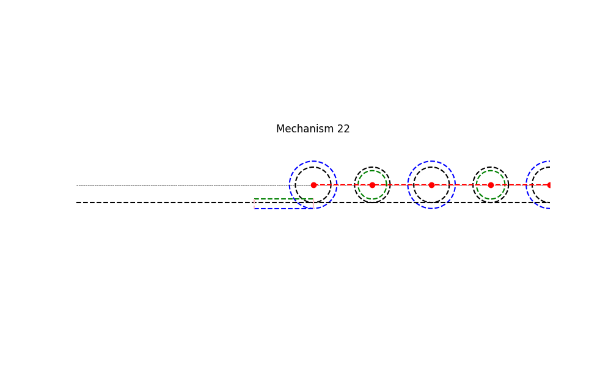

# Mechanism 22




Mechanism Description:
-----------------------
This mechanism is a continuous linear motion into reciprocating linear motion.
**Applications**:
This type of mechanism is intended to be used in the development of clamp-on self-actuated long-range linear motion mechanisms.


## Using the brianmechanisms module

```python

import brianmechanisms.reciprocating

quickreturn = reciprocating.linearmotion.quickreturn
print(quickreturn.mechanism22.info())


settings = quickreturn.mechanism22.Settings(
    R2=3, R3=4, L=10,
    num_wheels=6,
    displacement=0
)
mechanism  = quickreturn.mechanism22(settings)
# Note: Mechanism22 currently has a bug that will not allow you to run mechanism.plot().update() on a single instance. You will need to run plot() and update() on different instances of mechanism22
mechanism.plot().save("mechanism22").show() 

mechanism  = quickreturn.mechanism22(settings)
mechanism.update().save("mechanism22").show()


```