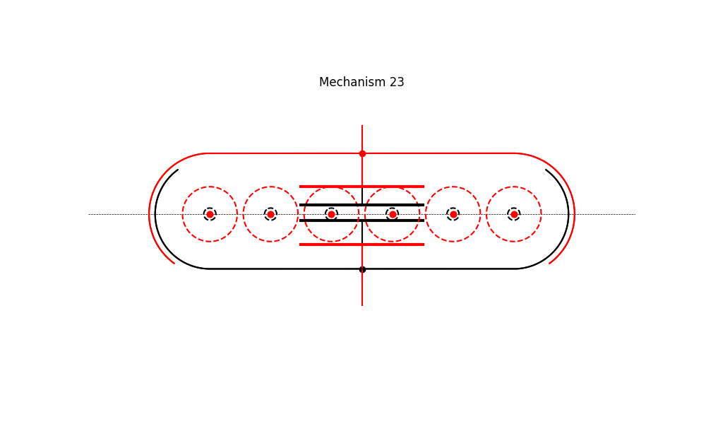
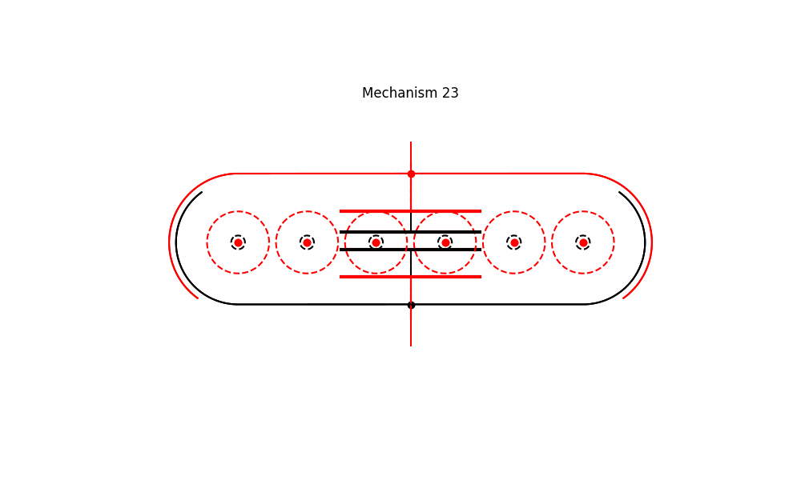

# Mechanism 23






Mechanism Description:
-----------------------
Multi-legged ULMW with quick return.
**Applications**:
This type of mechanism is intended to be used in the development of clamp-on self-actuated long-range linear motion mechanisms.


## Using the brianmechanisms module

```python

import brianmechanisms.reciprocating

quickreturn = reciprocating.linearmotion.quickreturn
print(quickreturn.mechanism23.info())


mechanism23 = quickreturn.mechanism23


settings = mechanism23.Settings(
    num_instances=2,
    num_wheels=6
)

mechanism = mechanism23(settings)
mechanism.plot().save("mechanism23").show()

mechanism = mechanism23(settings)
mechanism.update().save("mechanism23").show()


settings = mechanism23.Settings(
    num_instances=2
)
mechanism = mechanism23(settings)
mechanism.update().save("mechanism23-3l").show()


```