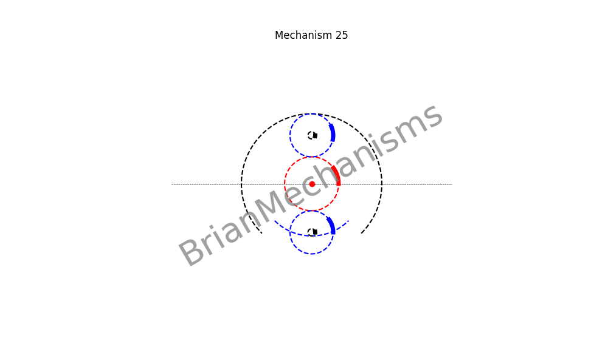

# Mechanism 25




>> This mechanism is not properly under `reciprocating/linearmotion/quickreturn` since it is a continuous rotary motion mechanism. However, it can be used to make quick return linear motion mechanisms.

Mechanism Description:
-----------------------
Continuous rotary motion with different constant velocities for different sections.
**Applications**:
This type of mechanism is intended to be used in the development of clamp-on self-actuated long-range linear motion mechanisms. and 2-spoke rimless wheels


## Using the brianmechanisms module

```python

from brianmechanisms.reciprocating.linearmotion import quickreturn
mechanism25 = quickreturn.mechanism25

print(quickreturn.mechanism25.info())

settings = mechanism25.Settings(
    num_instances=2
)

mechanism = mechanism25(settings)
mechanism.plot().save("mechanism25").show()
# mechanism.plot().show()

mechanism = mechanism25(settings)
mechanism.update().save("mechanism25").show()

```