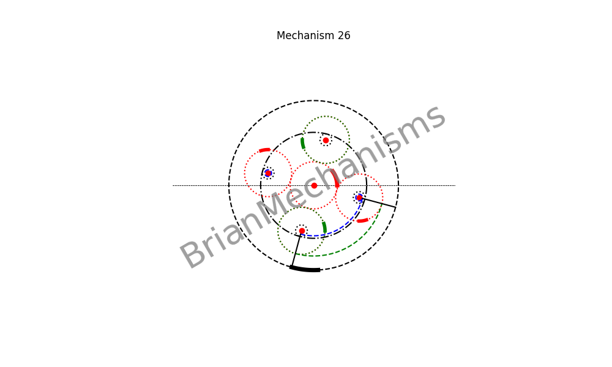
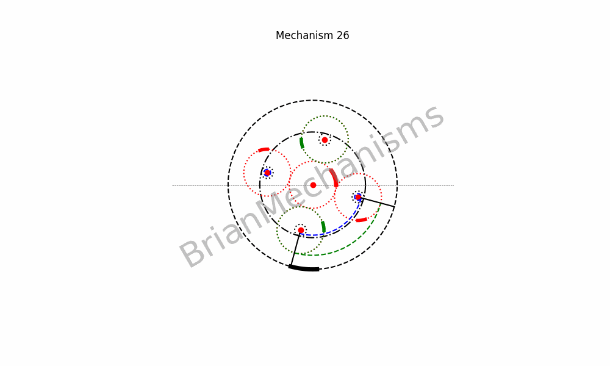

# Mechanism 26






>> This mechanism is not properly under `reciprocating/linearmotion/quickreturn` since it is a continuous rotary motion mechanism. However, it can be used to make quick return linear motion mechanisms.

Mechanism Description:
-----------------------
Continuous rotary to reciprocating rotary and/or linear motion with possible configuration for quick return.
**Applications**:
This type of mechanism is intended to be used in the development of clamp-on self-actuated long-range linear motion mechanisms.


## Using the brianmechanisms module

```python

from brianmechanisms.reciprocating.linearmotion import quickreturn
mechanism26 = quickreturn.mechanism26

print(quickreturn.mechanism26.info())

settings = mechanism26.Settings(
    frequency=2,
    animation_rounds=5,
    speed=0.15,
    R1 = 20
)

mechanism = mechanism26(settings)
mechanism.plot().save("mechanism26").show()

mechanism = mechanism26(settings)
mechanism.update().save("mechanism26").show()
mechanism.update().show()

```