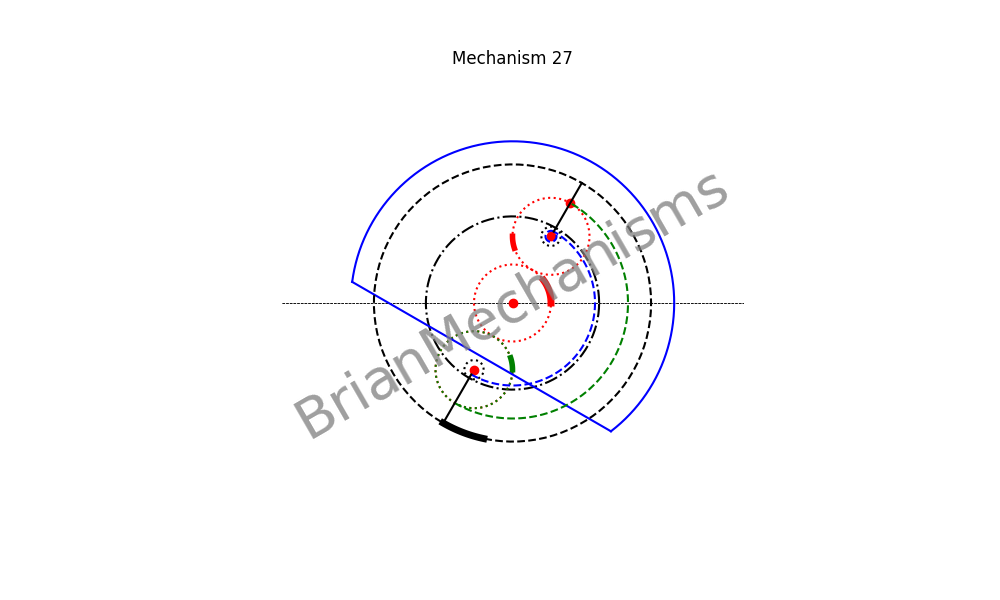

# Mechanism 27




>> This mechanism is not properly under `reciprocating/linearmotion/quickreturn` since it is a continuous rotary motion mechanism. However, it can be used to make quick return linear motion mechanisms.

Mechanism Description:
-----------------------
Mechanism 26 with cam mechanism added.
**Applications**:
This type of mechanism is intended to be used in the development of clamp-on self-actuated long-range linear motion mechanisms.


## Using the brianmechanisms module

```python

from brianmechanisms.reciprocating.linearmotion import quickreturn
mechanism27 = quickreturn.mechanism27

print(quickreturn.mechanism27.info())

settings = mechanism27.Settings(
    frequency=1,
    animation_rounds=1,
    speed=0.75,
    R1 = 20
)

mechanism = mechanism27(settings)
mechanism.plot().save("mechanism27").show()
# # mechanism.plot().show()

mechanism = mechanism27(settings)
mechanism.update().save("mechanism27").show()

```