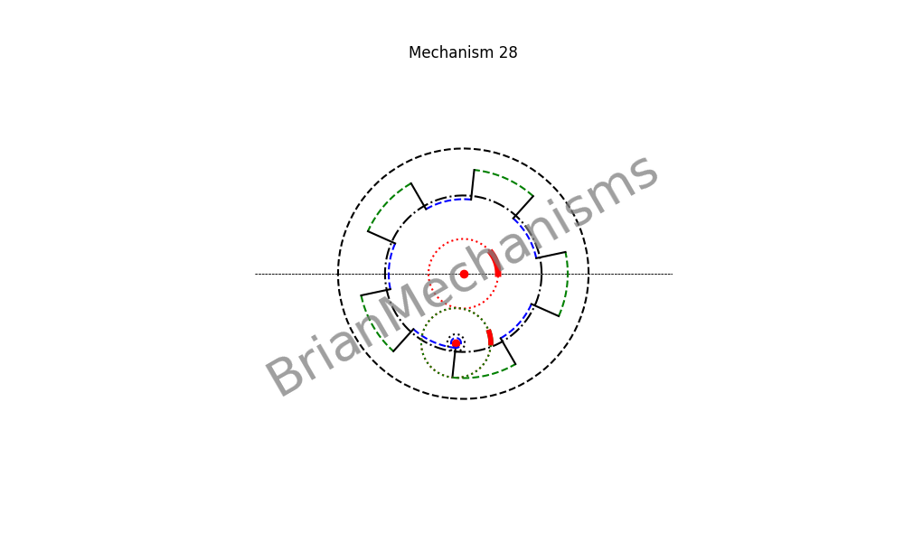

# Mechanism 28




>> This mechanism is not properly under `reciprocating/linearmotion/quickreturn` since it is a continuous rotary motion mechanism. However, it can be used to make quick return linear motion mechanisms.

Mechanism Description:
-----------------------
Continuous rotary to reciprocating rotary and/or linear motion with possible configuration for quick return.
**Applications**:
This type of mechanism is intended to be used in the development of clamp-on self-actuated long-range linear motion mechanisms


## Using the brianmechanisms module

```python

from brianmechanisms.reciprocating.linearmotion import quickreturn
mechanism28 = quickreturn.mechanism28

print(quickreturn.mechanism28.info())

settings = mechanism28.Settings(
    frequency=5,
    animation_rounds=1,
    speed=0.75,
    R1 = 20
)

mechanism = mechanism28(settings)
mechanism.plot().save("mechanism28").show()
# mechanism.plot().show()

mechanism = mechanism28(settings)
mechanism.update().save("mechanism28").show()

```