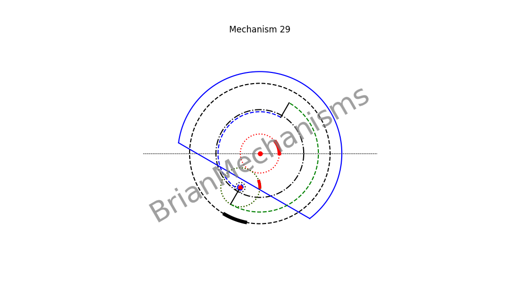

# Mechanism 29




>> This mechanism is not properly under `reciprocating/linearmotion/quickreturn` since it is a continuous rotary motion mechanism. However, it can be used to make quick return linear motion mechanisms.

Mechanism 28 with CAM mechanism.
**Applications**:
This type of mechanism is intended to be used in the development of clamp-on self-actuated long-range linear motion mechanisms.


## Using the brianmechanisms module

```python

from brianmechanisms.reciprocating.linearmotion import quickreturn
mechanism29 = quickreturn.mechanism29

print(quickreturn.mechanism29.info())

settings = mechanism29.Settings(
    frequency=1,
    animation_rounds=1,
    speed=1,
    R1 = 20
)

mechanism = mechanism29(settings)
mechanism.plot().save("mechanism29").show()

mechanism = mechanism29(settings)
mechanism.update().save("mechanism29").show()

```