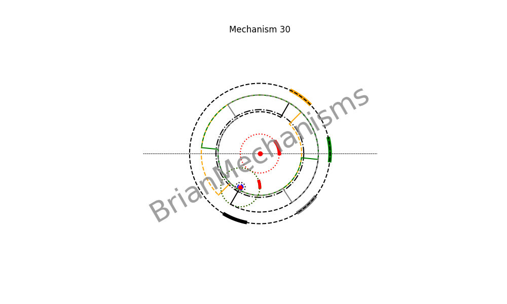

# Mechanism 30




>> This mechanism is not properly under `reciprocating/linearmotion/quickreturn` since it is a continuous rotary motion mechanism. However, it can be used to make quick return linear motion mechanisms.

Mechanism Description:
-----------------------
Multiple mechanism 28s on same axis with phase difference .
**Applications**:
This type of mechanism is intended to be used in the development of clamp-on self-actuated long-range linear motion mechanisms and walking mechanisms.


## Using the brianmechanisms module

```python

import numpy as np
from brianmechanisms.reciprocating.linearmotion import quickreturn
mechanism30 = quickreturn.mechanism30

print(quickreturn.mechanism30.info())

settings = mechanism30.Settings(
    frequency=1,
    animation_rounds=1,
    speed=1,
    R1 = 20,
    phase_difference = 0.3 * np.pi,
    num_instances = 4
)

mechanism = mechanism30(settings)
mechanism.plot().save("mechanism30").show()

mechanism = mechanism30(settings)
mechanism.update().save("mechanism30").show()

```