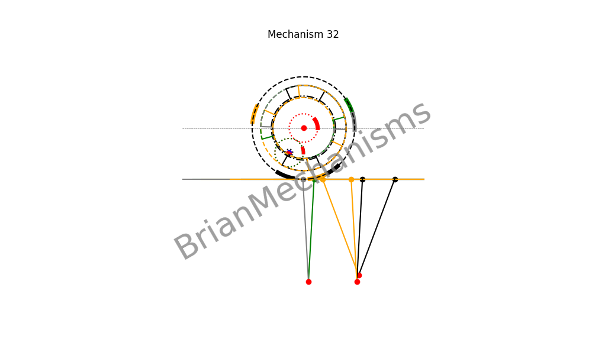

# Mechanism 32




Mechanism Description:
-----------------------
Walking Mechanism with uz = 0 and ux = k.
**Applications**:
This type of mechanism is intended to be used in the development of clamp-on self-actuated long-range linear motion mechanisms and walking mechanisms.


## Using the brianmechanisms module

```python

import numpy as np
from brianmechanisms.reciprocating.linearmotion import quickreturn
mechanism32 = quickreturn.mechanism32

print(quickreturn.mechanism32.info())

settings = mechanism32.Settings(
    frequency=1,
    animation_rounds=1,
    speed=2.5,
    R1 = 20,
    phase_difference = 0.1 * np.pi, # between hip joints of single leg
    phase_difference_for_legs = 0.75 * np.pi,
    num_legs = 3,
    hip_distance = 30 # distance between 2 hips of single leg

)

mechanism = mechanism32(settings)
mechanism.plot().save("mechanism32").show()

mechanism.update().save("mechanism32").show()

```