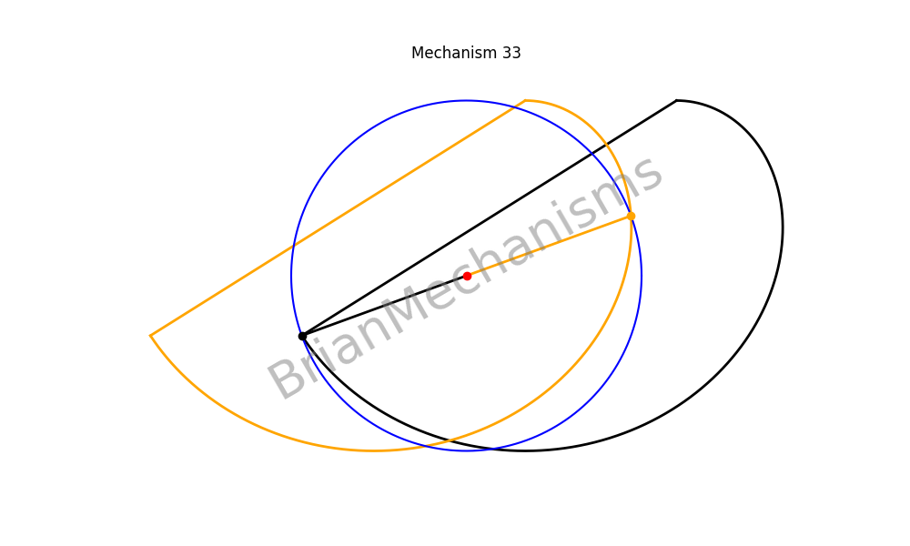

# Mechanism 33




Mechanism Description:
-----------------------
A variation of scotch-yoke with constant speed in forward stroke and quickreturn.
**Applications**:
Clamp-on long range linear motion mechanisms and walking mechanisms
**Notes**:
You may need to select values for stroke_length, start_theta and  forward_stroke_angle for which the cam profile will not cross the shaft axis in the case where multiple co-axial cams are used


## Using the brianmechanisms module

```python

import numpy as np
from brianmechanisms.reciprocating.linearmotion import quickreturn
mechanism33 = quickreturn.mechanism33

print(quickreturn.mechanism33.info())

settings = mechanism33.Settings(
    radius=1, 
    forward_stroke_angle=250, 
    speed=1, 
    animation_rounds=1, 
    num_instances = 2, 
    stroke_length=1.2, 
    start_theta=-160

)

mechanism = mechanism33(settings)
mechanism.plot().save("mechanism33").show()

mechanism.update().save("mechanism33").show()

```