||
|---|
|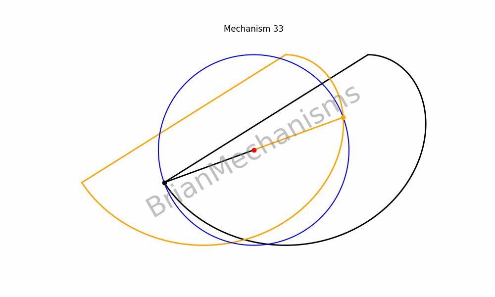 |
|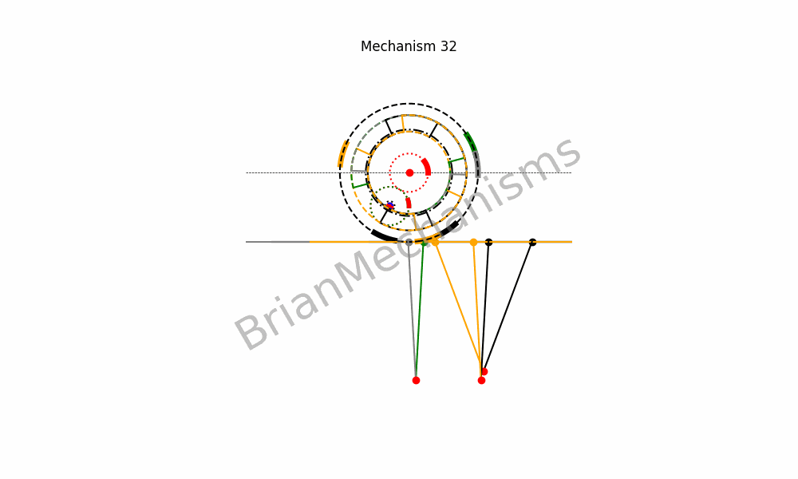 |
| |
|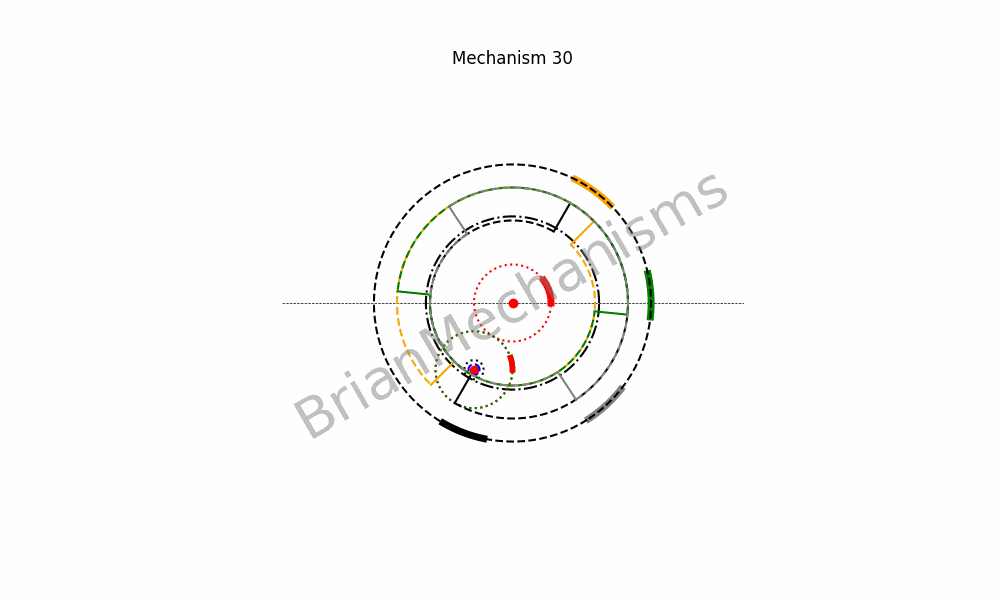 |
|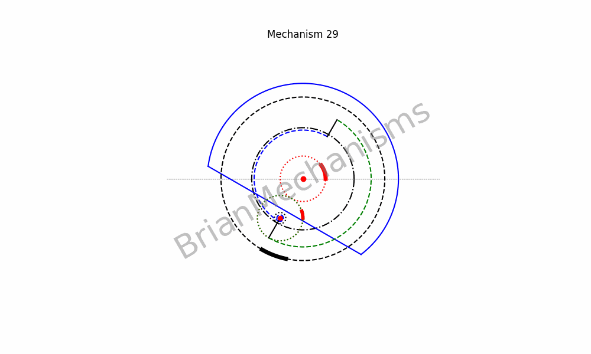 |
|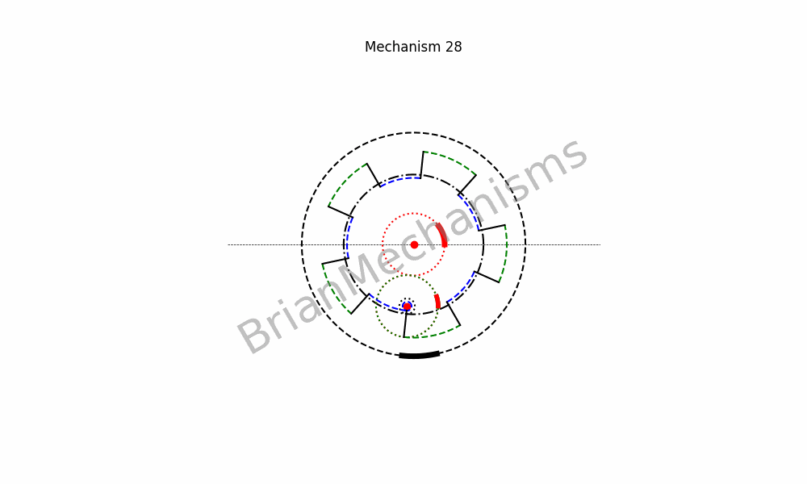 |
|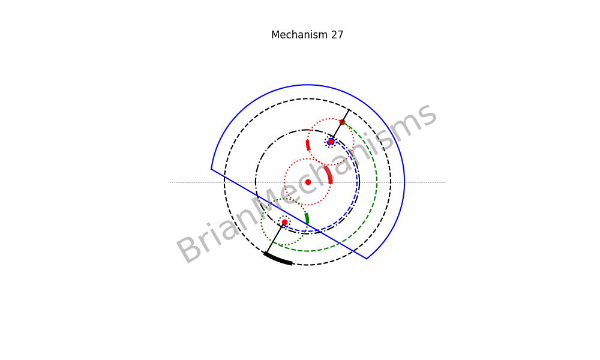 |
| |
|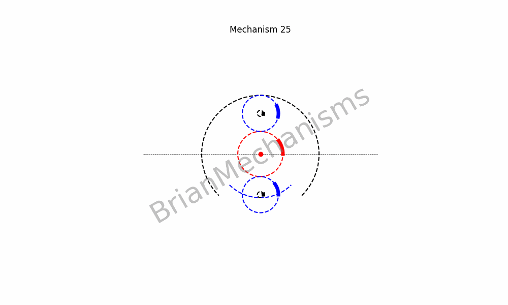 |
| |
|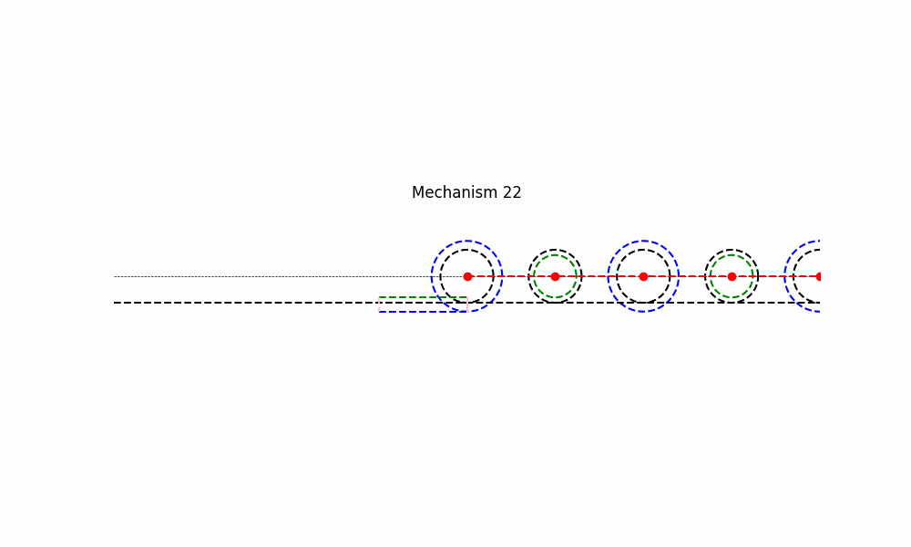 |

|||
|---|---|
|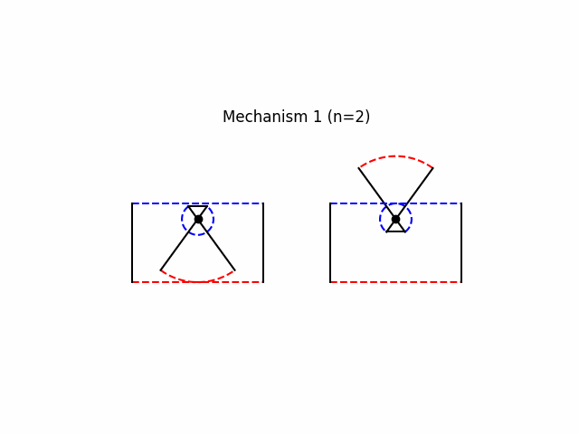 |
|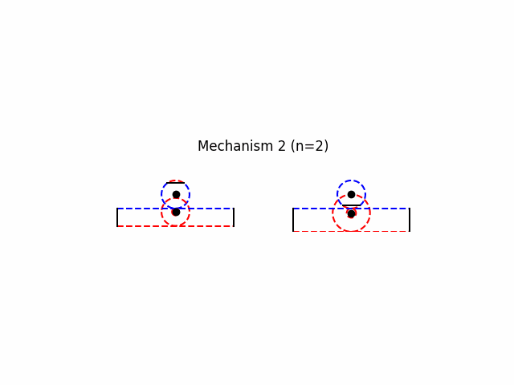 |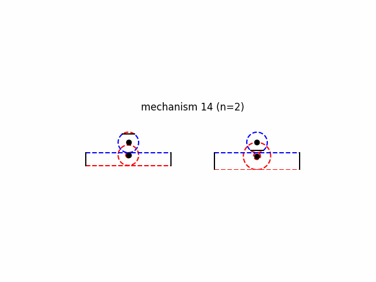
|Mechanism 16|Mechanism 16
|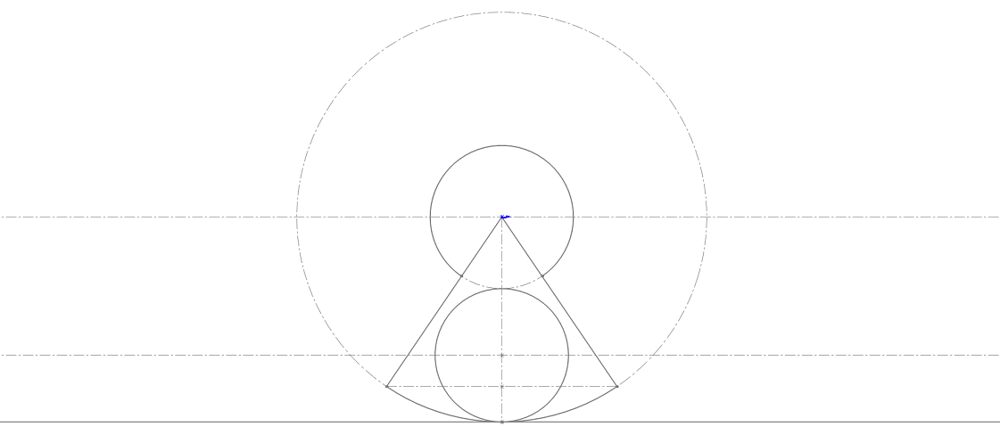|
|Mechanism 19|Mechanism 19
|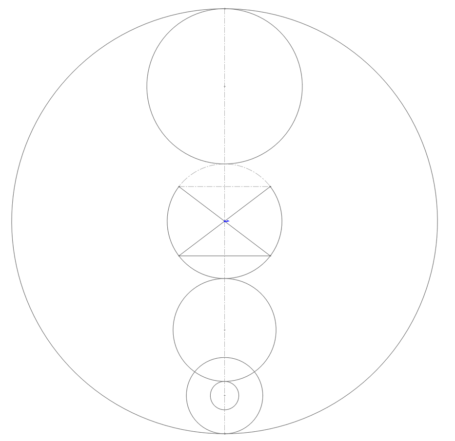|
|Mechanism 20|Mechanism 20
|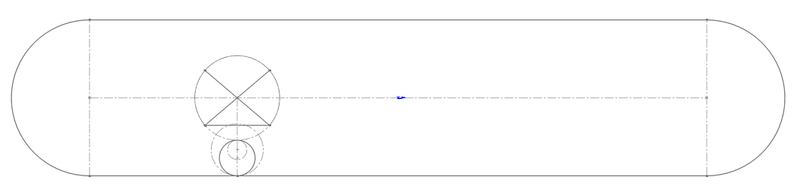|
|Mechanism 21|Mechanism 21
|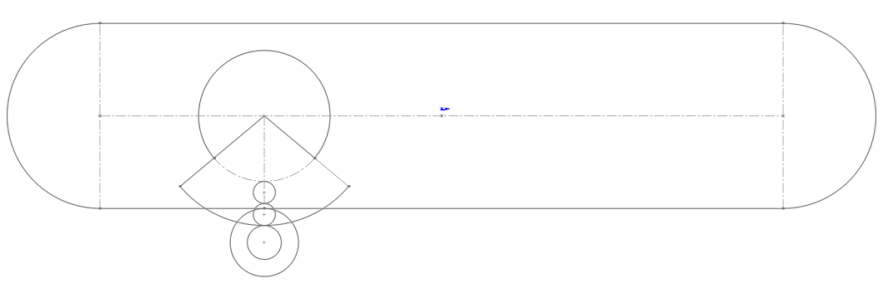|

(mechanism 12: mechanism1 with return slot) Work in progress. But not so promising due to lack of ability to extend stroke using compound gears. See sketches\mechanism12\main.py
|||
|---|---|
|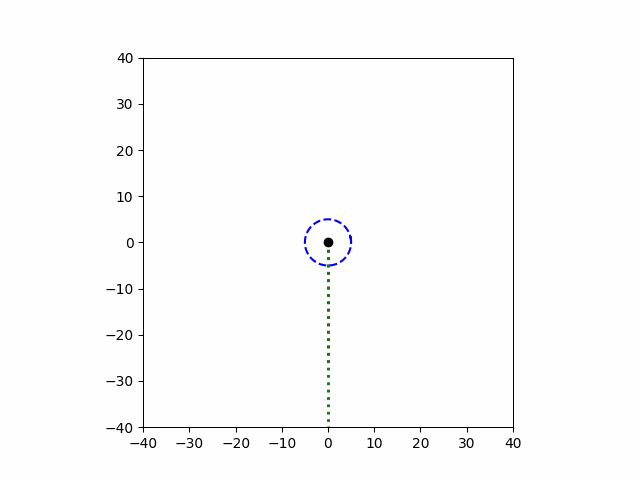 | 

Mechanism 6

Mechanism 7

Mechanism 8

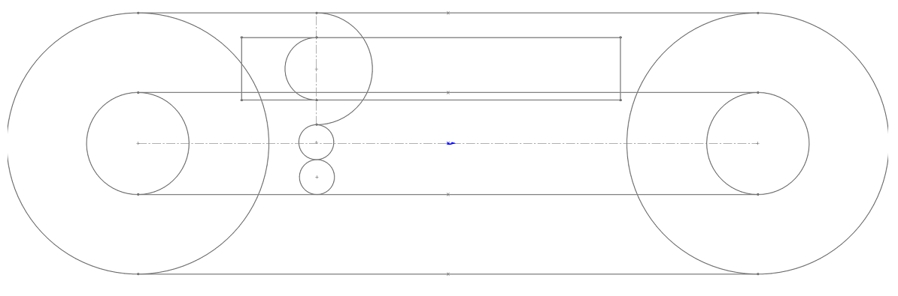

Mechanism 11

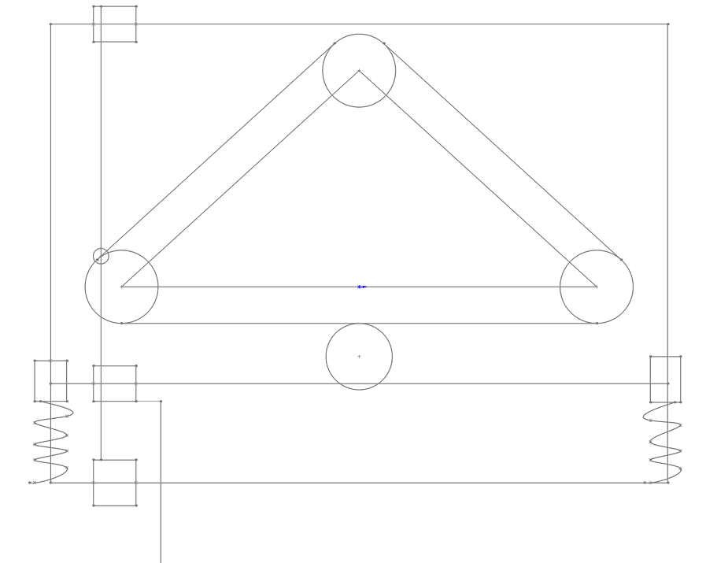

Mechanism 15

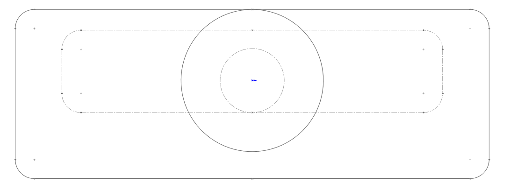

Mechanism 16

Todo:

Notes for mechanism 17 - for rimless wheel

Move mehanism 18 to correct place... continuous oppossite motion (rotary)