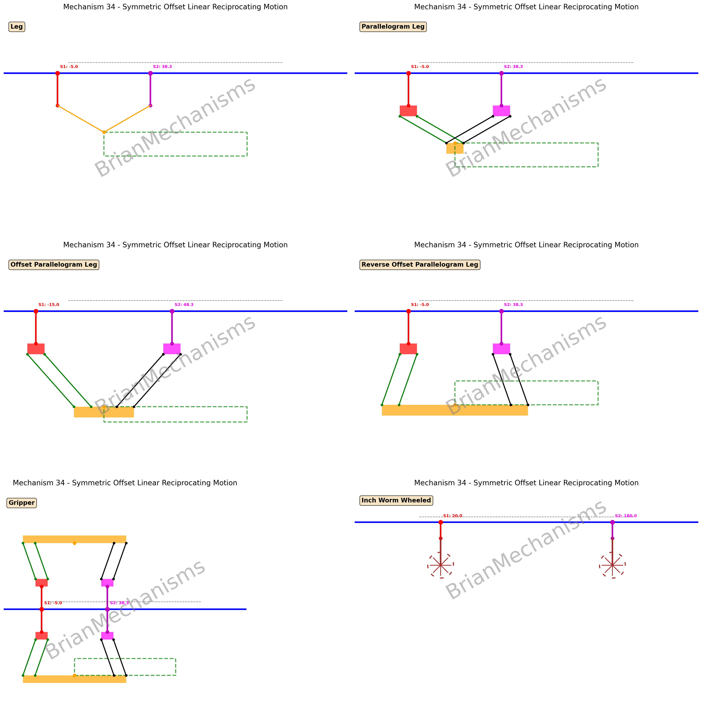
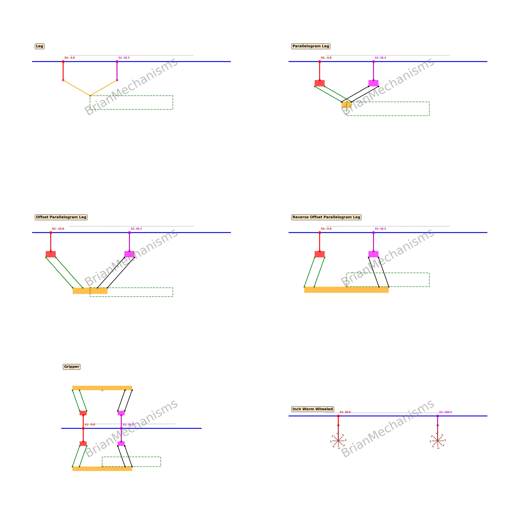

# Mechanism 34





Mechanism Description:
-----------------------
Walking motion system with linkage featuring dual sliders with phase difference for synchronized reciprocating motion and various attachment types.

**Applications**:
- Walking mechanisms
- Inchworm-style actuators
- Inchworm wheeled mechanisms
- Cable mechanisms
- Gripper linear motion mechanisms
- Turbines

**Notes**:
This mechanism supports multiple attachment configurations:
- **leg**: Simple triangular leg attachment
- **second leg configuration**: Parallelogram leg with optional offset and gripper mode
- **wheels**: Synchronized wheel rotation with walking motion

The mechanism uses phase-controlled dual sliders with adjustable parameters for stroke length, linkage dimensions, and attachment-specific settings.

## Using the brianmechanisms module

```python

import sys
import os
parent_dir = os.path.abspath(os.path.join(os.path.dirname(__file__), '../../packages/brianmechanisms/src'))
sys.path.insert(0, parent_dir)
import numpy as np

# Direct import to avoid sklearn dependency
sys.path.insert(0, os.path.join(parent_dir, 'brianmechanisms', 'reciprocating', 'linearmotion', 'walking'))
sys.path.insert(0, os.path.join(parent_dir, 'brianmechanisms', 'utils'))
from _34 import mechanism34

print("=== Mechanism 34 - Complete Showcase ===")
print(mechanism34.info())

# 1. Leg1 - Basic leg attachment
settings_leg1 = mechanism34.Settings(
    stroke_length=40,
    phase_difference=(0.5/90 * np.pi)*30, 
    slider_offset=30,
    linkage_height=50,
    linkage_width=100,
    frequency=1,
    animation_rounds=1,
    speed=1,
    motion_type='symmetric',
    attachment_type='leg1',
    attachment_length=25,
    show_plots=False,
    display_label='Leg',
)

mechanism_leg1 = mechanism34(settings_leg1)
mechanism_leg1.plot().save("mechanism34_all_leg1")
mechanism_leg1.update().save("mechanism34_all_leg1")

# 2. Leg2 with parallelogram offset
parallelogram_offset=10
settings_leg2b = mechanism34.Settings(
    stroke_length=40,
    phase_difference=(0.5/90 * np.pi)*30, 
    slider_offset=30+parallelogram_offset*2,
    linkage_height=50,
    linkage_width=100,
    frequency=1,
    animation_rounds=1,
    speed=1,
    motion_type='symmetric',
    attachment_type='leg2',
    attachment_length=25,
    show_plots=False,
    parallelogram_offset=10,
    display_label='Offset Parallelogram Leg',
)

mechanism_leg2b = mechanism34(settings_leg2b)
mechanism_leg2b.plot().save("mechanism34_all_leg2b")
mechanism_leg2b.update().save("mechanism34_all_leg2b")

# 3. Wheeled configuration  
settings_wheels = mechanism34.Settings(
    stroke_length=40,
    phase_difference=(0.5/90 * np.pi)*30, 
    slider_offset=30,
    linkage_height=50,
    linkage_width=100,
    frequency=1,
    animation_rounds=1,
    speed=1,
    motion_type='symmetric',
    attachment_type='wheels',
    attachment_length=25,
    wheel_radius=12,
    show_plots=False,
    display_label='Inch Worm Wheeled',
)

mechanism_wheels = mechanism34(settings_wheels)
mechanism_wheels.plot().save("mechanism34_all_wheels")
mechanism_wheels.update().save("mechanism34_all_wheels")

```