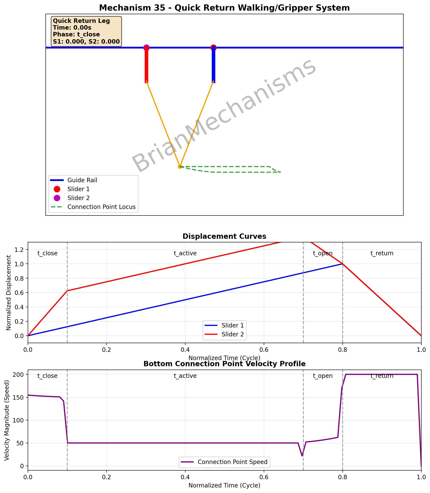
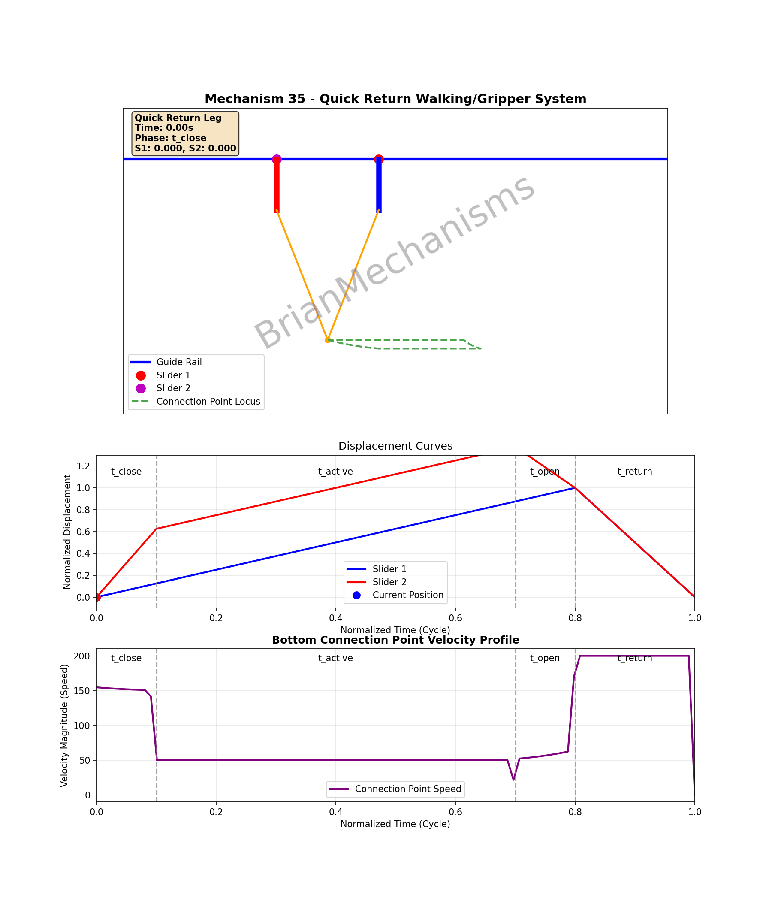

# Mechanism 35





Mechanism Description:
-----------------------
Quick Return Walking/Gripper System with advanced timing control and variable velocity profiles. This mechanism extends mechanism 34 with quick return capability for optimized walking and gripper applications.

**Applications**:
- Walking mechanisms with optimized gait timing
- Gripper systems with precise open/close control
- Inchworm actuators with quick return
- Multi-phase locomotion systems

**Key Features**:
- Quick return motion profile for efficient cycling
- Configurable timing phases for leg/gripper control:
  * Closing/lowering phase before active stroke
  * Active forward stroke with leg down/gripper closed
  * Opening/raising phase before return stroke begins
  * Quick return stroke with leg up/gripper open
- Variable velocity profiles: Slider 1 (constant velocity), Slider 2 (faster → same → slower → same)
- Real-time displacement curves and velocity profiles
- Connection point locus visualization

**Notes**:
This mechanism features precise timing control enabling the use of just 2 sets for working walking/gripper mechanisms instead of more. The quick return ratio and displacement difference parameters provide intuitive control over the motion characteristics.

## Using the brianmechanisms module

```python

import sys
import os
parent_dir = os.path.abspath(os.path.join(os.path.dirname(__file__), '../../packages/brianmechanisms/src'))
sys.path.insert(0, parent_dir)
import numpy as np

# Direct import to avoid sklearn dependency
sys.path.insert(0, os.path.join(parent_dir, 'brianmechanisms', 'reciprocating', 'linearmotion', 'walking'))
sys.path.insert(0, os.path.join(parent_dir, 'brianmechanisms', 'utils'))
from _35 import mechanism35

print("=== Mechanism 35 - Quick Return Complete Showcase ===")
print(mechanism35.info())

# Common settings for all variants
common_settings = {
    'stroke_length': 40,
    'phase_difference': 0,  # No phase offset - timing controlled by quick return phases
    'linkage_height': 50,
    'linkage_width': 100,
    'frequency': 1,
    'animation_rounds': 1,
    'speed': 1,
    'attachment_length': 25,
    # Quick return timing parameters
    'quick_return_ratio': 0.2,  # 20% for return stroke (simple interface)
    'closing_duration_fraction': 0.1,  # 10% for closing/lowering
    'opening_duration_fraction': 0.1,  # 10% for opening/raising
    # Slider 2 velocity control
    'displacement_difference_fraction': 0.5,  # Make slider 2 get ahead by 50% of stroke during t_close
}

# Quick Return Leg - with displacement curves and velocity profile
settings_leg1 = mechanism35.Settings(
    **common_settings,
    slider_offset=30,
    attachment_type='leg1',
    display_label='Quick Return Leg',
    show_mechanism=True,
    show_displacement=True,
)

mechanism_leg1 = mechanism35(settings_leg1)
mechanism_leg1.plot().save("mechanism35_all_leg1")
mechanism_leg1.update().save("mechanism35_all_leg1")

# Additional variants available: leg2a, leg2b, leg2c, leg2d (gripper), wheels

```