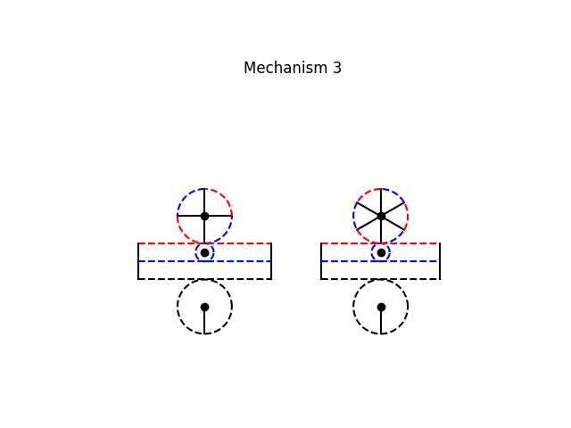
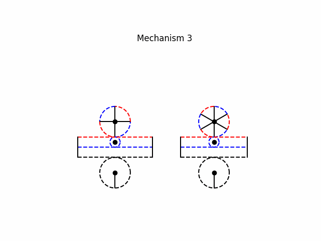

# Mechanism 3






Mechanism Description:
-----------------------
This mechanism is a for converting constant velocity rotary input to oscillating rotary output. It is constructed using a compound mangled pinion, 2 full pinions and 2 racks:

Use with { n ∈ ℤ ∣ n is even and n > 2 }
- **Constant Velocity:** The mechanism ensures a uniform linear speed during the forward stroke, providing smooth and consistent motion.
- **Quick Return:** It incorporates a quick return feature, which means the return stroke (or reverse movement) is faster than the forward stroke. This is achieved by utilizing a specific gear ratio and mechanical design to reduce the time taken for the return phase.
- **Adjustable Parameters:** Key parameters such as the radius of the pinions, the gear ratios, and the center distance between the racks can be adjusted to suit different 
applications and performance requirements.

**Disadvantage**:
One notable disadvantage of this mechanism is the potential for shock loading. This occurs due to the instantaneous change in direction at the ends of the strokes, where the mechanism transitions from forward to return motion and vice versa. This sudden change in speed can result in mechanical stress and vibrations, which may lead to wear and tear or reduced longevity of the components if not properly managed.

**Applications**:
This type of mechanism is intended to be used in the development levelling systems for rimless wheels.


## Using the brianmechanisms module

```python

import brianmechanisms.reciprocating.rotarymotion as rotarymotion

mechanism3 = rotarymotion.mechanism3
print(mechanism3.info())

settings = mechanism3.Settings(
    [
    {
        'radius1': 3,
        'radius2': 1,
        "n":4
    }
    ,{
        'radius1': 3,
        'radius2': 1,
        "n":6
    }
    ,
    ],
    n=4,
    rotations = 2,
    speed = 0.5
)
mechanism  = mechanism3(settings)
mechanism.plot().save("mechanism3").show()
mechanism.update().save("mechanism3").show()


```